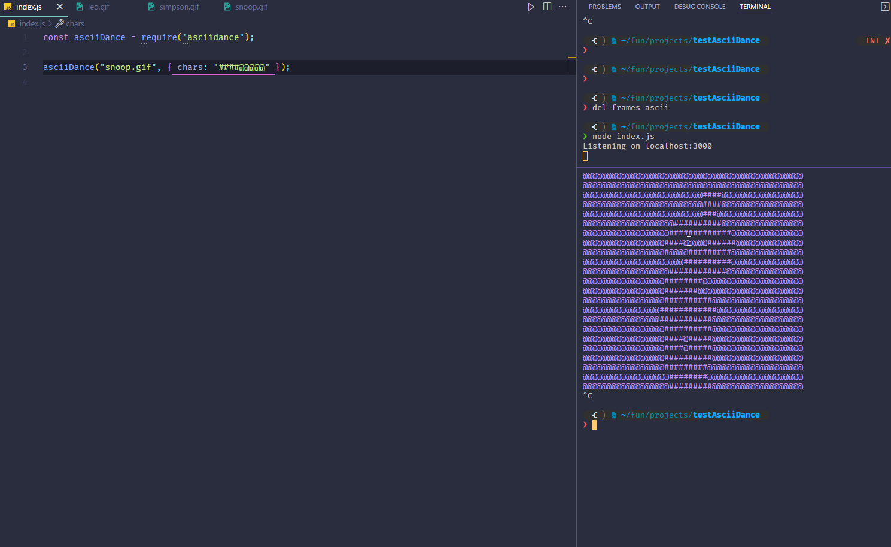

# Asciidance

This project is inpired from [parrot.live](https://github.com/hugomd/parrot.live).  

Basically i wanted to make any gifs to ascii and make it dance on terminal hence the name **asciidance**.  

So The process of getting this result for any gifs is:  

1. you need a gif
2. we have to extract frames from gifs
3. at last we have to turn those frames to ascii

All of this happen will happen behind the secene when you use **asciidance**  

Here is the quick example  
  

## Install

```bash
npm install asciidance
```

## Before running examples

1. You have to put your gifs on a `gifs` folder  
2. Everytime you run the code again (as you can see in a quick example above) you have to delete both `ascii` and `frames` folder  
3. You have to install `jp2a` on your computer
   1. For installing on Windows use [wsl](https://docs.microsoft.com/en-us/windows/wsl/install)
   2. For installin on Mac use [brew](https://formulae.brew.sh/formula/jp2a)
   3. For installing on Ubuntu use `sudo apt-get install jp2a`

## Example

```js
const asciidance = require("asciidance");

asciidance("snoopdog.gif", { border: "border" })
```

### Custom characters  

```js
const asciidance = require("asciidance");

asciidance("snoopdog.gif", { chars: "!@#$%^&()_+" })
```

  

### border

```js
const asciidance = require("asciidance");

asciidance("snoopdog.gif", { border: "border" });
```


### flip-horizontal


```js
const asciidance = require("asciidance");

asciidance("snoopdog.gif", { flipx: "flipx" });
```


### flip-vertical

```js
const asciidance = require("asciidance");

asciidance("snoopdog.gif", { flipy: "flipy" });
```


---

## API

### asciidance(gifFile, asciiConfig?)  

#### gifFile  

Type: `string`  
Your gif file name

#### asciiConfig

Type: `object`  
Options for how you ascii should look like  

##### bg

Type: `string`  
Default: `dark`  

The other option is `light`

##### chars

Type: `string`  
Default: [jp2a default chars](https://csl.name/jp2a/)  

Here is the [example](#Custom-characters)  

##### Border

Type: `string`  
Default: `undefined`  

You can set it to `border`  
Here is the [example](#border)  

##### flipx

Type: `string`  
Default: `undefined`  

You can flip the ascii in the x axis  
Here is the [example](#flip-horizontal)


##### flipy

Type: `string`  
Default: `undefined`  

you can flip the ascii in the y axis  
Here is the [example](#flip-vertical)

---

## Buggy behaviour

Intentionally i run one code after 2s. Here is the [link](https://github.com/DanielCodex/asciidance/blob/071add85490b1a6551eefec6e78115c0a105b938/index.js#L46)  

For some reason which i don't know yet, if we remove this delay and run the code for the first time, the moment we run `curl localhost:3000` we won't get any result in terminal.  

So i suspect that the reason for that is because the ascii folder is not populated yet the moment the `makeItDance()` is called.  

That's why i delay the called for `makeItDance()` function.  

If you used a gifs which was really long (i haven't seen a long gifs myself 🤔😂) you might not see anything on terminal the moment you run `curl localhost:3000`.  

In order for that to work just run the your code again and run `curl localhost:3000` (it will works)
